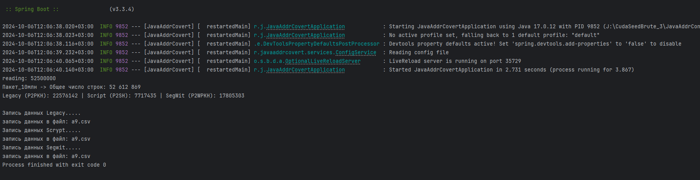

https://github.com/ssvt/JavaAddrCovert

## Конвертирование адресов Bitcoin в hash160, сортировка и сохранение в файлы csv.
Для использования как баз данных для программ Brute-force. (Автора Anton Houzich)
По сути это аналог его же рограммы Convert-Addresses-To-Hash160-For-Brute-Force, просто реализовано по своему.

## Описание
При запуске программы считывается файл конфигурации для программы Brute.
Файл обычно лежит в каталоге с программой Антона и прописан в этой строчке
> private final String configFile = "D:\\COMMON\\TEMP\\config.cfg";

далее исходные данные считываются из файла прописанногов строчке
> private static String ORIGIN_ADDR = "D:\\COMMON\\TEMP\\tables_origin\\all_addresses.txt";

файл содержит все адреса bitcoin с балансами. Считывается построчно и складывается 
в 3 разных соллекции и сортируюся.  Далее эти коллекции выгружаются по папкам, указанных
в конфигурационном файл. 
При работе программы, учитывайте что файл со всеми адресами имеет размер более 2Гб. Соответственно все эти данные 
изначально хранятся в памяти. 

